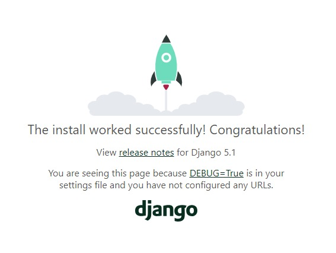

# Este é o README do curso de Django 2 do Matheus Battisti - Hora de Codar

Vídeos do curso estão disponíveis no [canal do YouTube do Matheus](https://youtube.com/playlist?list=PLnDvRpP8BnewqnMzRnBT5LeTpld5bMvsj&si=5ayrEysD8L15KEF1)

----

### Aula 01 - [Instalando o Django no Windows]()
- Na aula é abordado a instalação do Django e a criação do primeiro ambiente virtual

**Criar uma VirtualEnv nova**

    $ virtual [nome-da-virtual-env]

**Acessar VirtualEnv**

    $ source [nome-da-virtual-env]/Scripts/activate

**Instalar o Django dentro da Env**

    $ pip install django

**Criar o projeto**

    $ django-admin startproject [nome-do-projeto]

**Listar os diretórios que estão dentro da pasta**

    $ ls

**Acessar à pasta do projeto**

    $ cd [nome-do-projeto]

**Listar os diretórios que estão dentro da pasta**

    $ ls

**Para iniciar o servidor do Django**

    $ python manage.py runserver

### Para verificar se o Django está rodando, basta acessar o "localhost:8000" no navegador




### Aula 02 - Instalando o Django no Linux


### Aula 03 - [Iniciando o Projeto do Curso, criando URL e View]()

### Projeto x App

- **Projeto** pode ser entendido como a aplicação num contexto geral: site de receita por exemplo.

- Um **app** fornece uma funcionalidade específica no site. Geralmente pensamos que essa funcionalidade possa ser reutilizada em outro projeto.

- Segundo a documentação do Django, o termo **projeto** descreve uma aplicação web, enquanto o termo **app** descreve um pacote Python que fornece algum conjunto de recursos.

- Um **projeto** pode conter vários **apps**. Um **app** pode estar em vários **projetos**.

### Arquivo "\_\_init\_\_.py"
- Serve para dizer ao python que tem arquivos que precisam ser executados na pasta

### Arquivo "settings.py"
- Contém todas as configurações do projeto

### Arquivo "urls.py"
- Contém as URLs do projeto

### Criar um app
    $ django-admin startapp [nome-do-app]
Depois de criar a **variável** é necessário que no arquivo **"settings.py"** na parte de **"INSTALLED_APPS"** sejam declarados todos os apps criados

### Como integrar o app ao projeto fazendo com que ele acesse uma URL de um app

- Criar um arquivo com o nome "urls.py" dentro da pasta do app que for integrar
- Dentro do arquivo colocar o código base do arquivo "urls.py" presente no projeto removendo a primeira linha, já que precisa de ser importado só para o projeto e não para todos os aplicativos
````
from django.urls import path

urlpatterns = [
    path('admin/', admin.site.urls),
]
````
**É necessário criar a URL com um path, pois vai definir o nome da URL e a função de view que vai ser acessada no arquivo de "views.py"**
Além disso é importante que antes do nome da função na view, dizer que ele vem de views com um "views.[função-da-view]"
````
path('[nome-da-url]', [função-na-view])
````
**É importante importar o arquivo views pro django entender de onde ta vindo a view do comando path**
    from . import views

**Ficando com o seguinte código:**

````
from django.urls import path
from . import views

urlpatterns = [
    path('[nome-da-url]', views.[função-na-view]),
]
````

**Pra finalizar, vamos criar a função no arquivo "views.py"**

Toda view é passado o argumento de (request)

````
def [nome-da-view](request):
    return HttpResponse('HelloWorld')
````
O **HttpResponse** é um argumento que só retorna uma resposta o http caso a URL seja acessada com sucesso

Pra usar esse argumento é necessário importar o pacote

````
from django.http import HttpResponse
````

Para fazer com que o django entenda que tem um app com urls a serem acessadas

- Ir no arquivo de URL do projeto
- Importar o **include** do pacote URL
````
from django.urls import path, include
````
- Adicionar o path
````
path('[caminho-do-accesso-ao-app]', include('[nome-do-app].urls'))
````

### Para ver o resultado basta ir no navegador e ir para o "localhost:8000/helloworld/"

### Aula 04 - [URLs, Views e Templates]()


### Aula 05 - [Estendendo templates e template base para o projeto]()


### Aula 06 - [Instalando o Django no Windows]()


### Aula 07 - [Instalando o Django no Windows]()


### Aula 08 - [Instalando o Django no Windows]()


### Aula 09 - [Instalando o Django no Windows]()


### Aula 10 - [Instalando o Django no Windows]()


### Aula 11 - [Instalando o Django no Windows]()


### Aula 12 - [Instalando o Django no Windows]()


### Aula 13 - [Instalando o Django no Windows]()


### Aula 14 - [Instalando o Django no Windows]()


### Aula 15 - [Instalando o Django no Windows]()


### Aula 16 - [Instalando o Django no Windows]()


### Aula 17 - [Instalando o Django no Windows]()


### Aula 18 - [Instalando o Django no Windows]()


### Aula 19 - [Instalando o Django no Windows]()


### Aula 20 - [Instalando o Django no Windows]()


